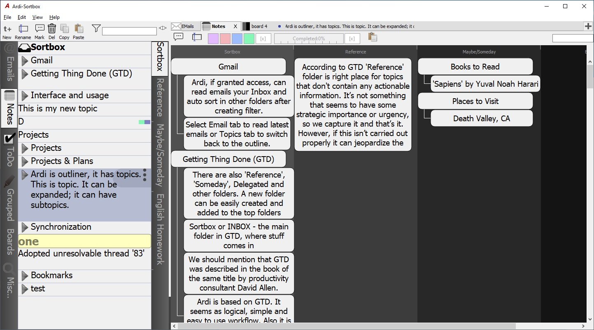
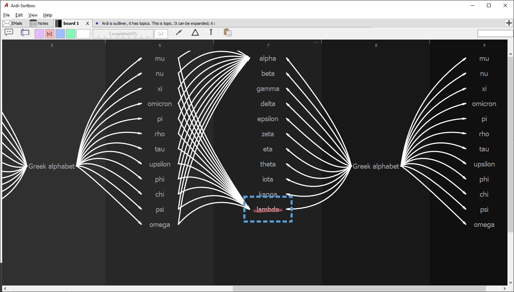

# OsoftArdi
Ardi - GMail client and organizer for notes, tasks, contacts, emails. Project currently in not being develop or supported, it's code is published here for reference only.

## Youtube demos
[Boards](https://www.youtube.com/watch?v=PBuG7qXHCkc)\
[Outline and Gmail](https://www.youtube.com/watch?v=oBwrf6iCZX8)\
[Authorize Gmail access](https://www.youtube.com/watch?v=yLqbXYmIFag)

## Project Outline
Project was starter by Qt enthusiasts when C++11 became available. We wanted to build rich Gui application facing Gmail API using composable asynchronous functions. So we created single threaded framework for it. See osoftteam/dropboxQt, osoftteam/googleQt. Next we needed better layout classes to present data as trees, outlines and graphs, we linked graphviz to the project, no development was required but some configuration in building, all included in this repo. We had SQLite as backend to data, DB was syncronized with GDrive via googleQt. Objects were loaded from DB and from local Gmail cache on demand. We used memory pools to alocate objects and application was fast even it was single threaded. To display objects we used QGraphicsItem classes, it fact most of GUI are different layouts of QGraphicsItem objects - as outlines, tables or graphs. Please see some samples of outlines below.

## Screenshots

